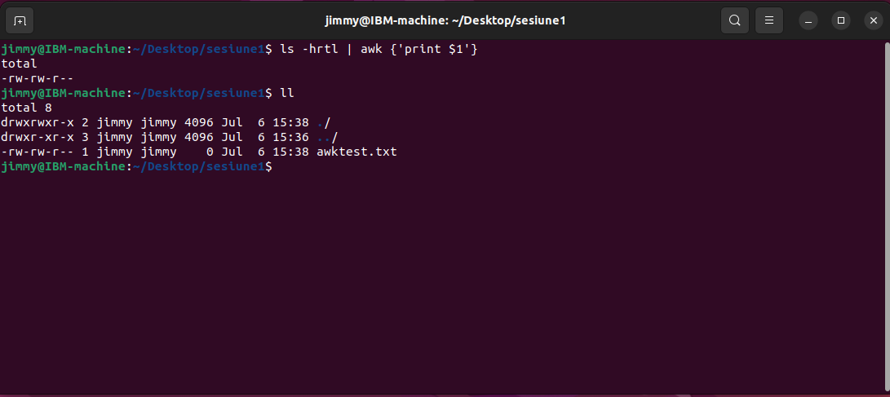
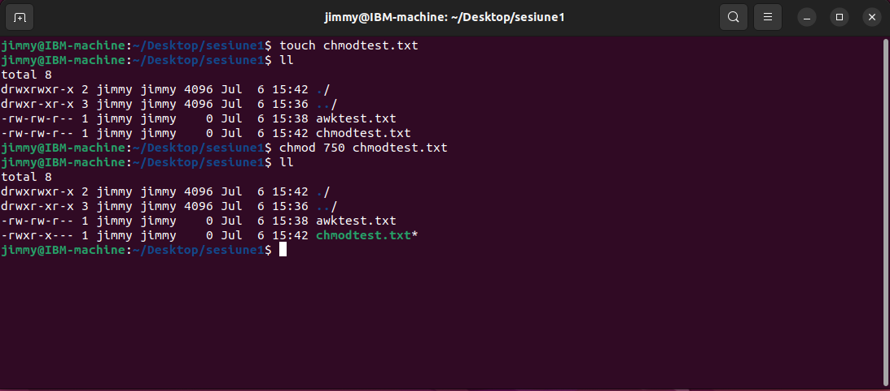
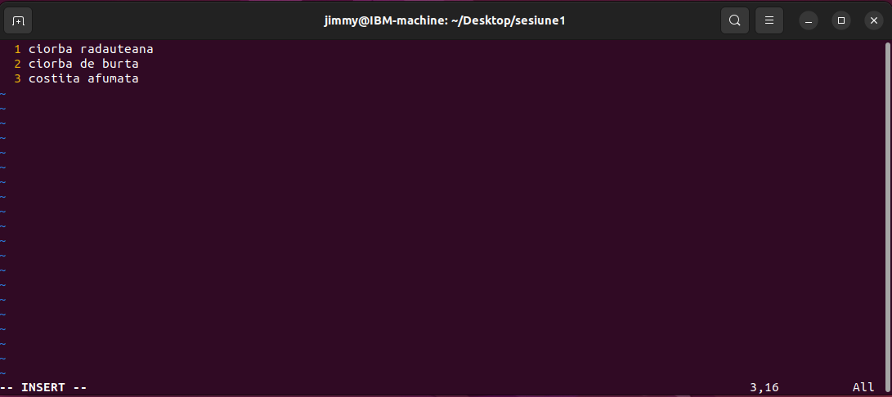
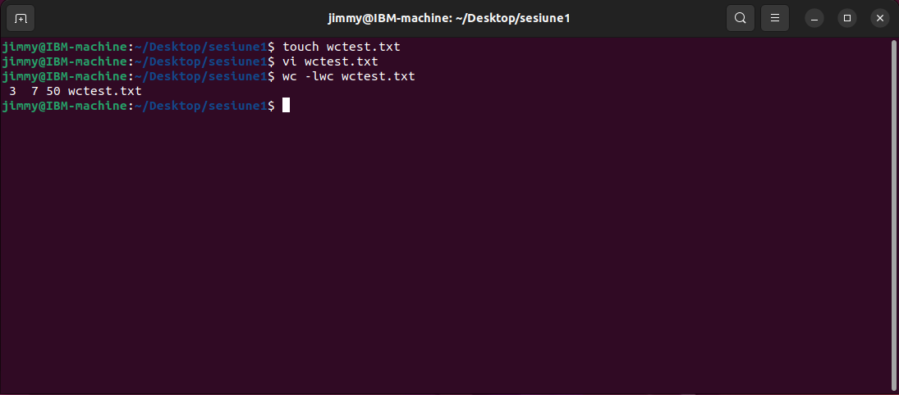
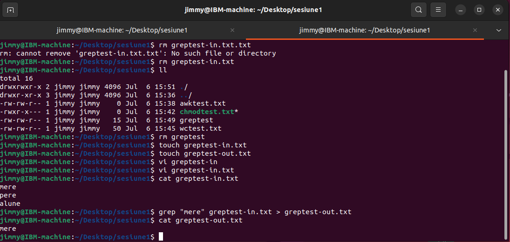
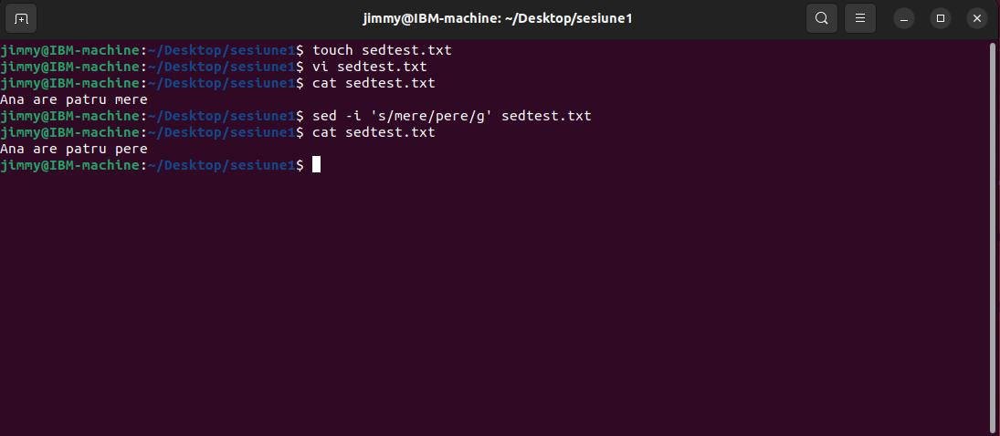
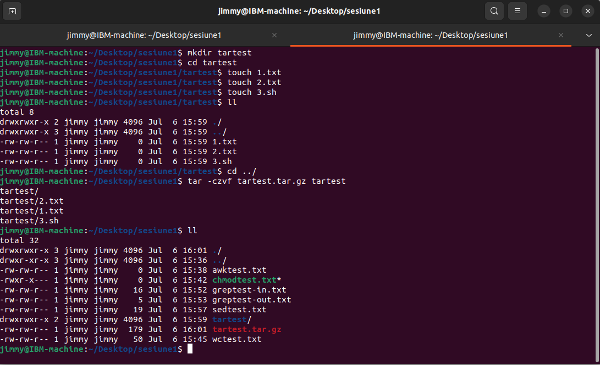

# IBM-Practica-Virgil

## Cuprins

 1. [Caiet practica](#caiet-practica)
 2. [Teme](#teme)
 3. [Proiect](#proiect)
 4. [Resurse](#resurse)


## Caiet practica
### Sesiunea 1
 
### Sesiunea 2

### Sesiunea 3

### Sesiunea 4

### Sesiunea 5

### Sesiunea 6

### Sesiunea 7


## Teme
### Sesiunea 1
 1. Use the awk command to extract the „rights” column of a document/file/folder and output it in the terminal.
 ```console
  ls -hrtl | awk {'print $1'}
 ```
 

  2. Use the chmod command to change the permissions of a file as it follows : user has read write execute, group has read and execute, others have nothing at all.
 ```console
  chmod 750 chmodtest.txt
 ```
 

  3. Use the wc command to count the number of lines, words, and characters in a file or set of files.
 ```console
  wc -lwc wctest.txt
 ```
 
 

  4. Use the grep command to search for a specific keyword in a file or set of files and output the results to a new file.
 ```console
  grep "mere" greptest-in.txt > greptest-out.txt
 ```
 

  5. Use the sed command to find and replace a specific string in a file
 ```console
  sed -i 's/mere/pere/g' sedtest.txt
 ```
 

  6. Use the tar command to create a compressed archive of a directory
 ```console
  tar -czvf tartest.tar.gz tartest
 ```
 

  7. Create a bash script that takes as input a log file and executes a search in it, using grep for the keyword “error”. As soon as the “error” word is detected through the log file, the script should return a message saying “Errors found in log <name_of_log>”.

  Note: Do not forget to include the fullpath to the file before it’s name, when called as a parameter to the script run. Also, the log file must be populated by you.

  
### Sesiunea 2

### Sesiunea 3

### Sesiunea 4

### Sesiunea 5

### Sesiunea 6

### Sesiunea 7


## Resurse